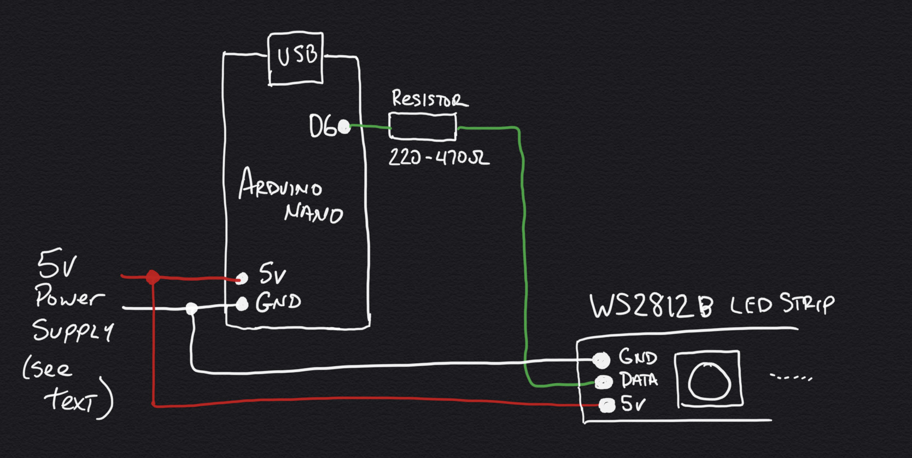

# HyperDrive

Flite Test is doing a build video on the HyperDrive that Jesse Perkins and I built for their Whoop Course at Edgewater Airpark. This GitHub is in support of that video.

# New To GitHub?
Since there will be many new users coming to the platform in search of this code, no fear, you only need a few things from here. (1) This document on electronic parts, links, and code modifications, and (2) the code itself. You've already found this document, and the code is downloaded by using the green button above that says "Clone or Download". Select "Download ZIP" and expand it in your arduino code or documents folder. The code is located in the "hyperDrive" folder. That's all you really need to get started.
If you would like to get more involved in adding to the project, visit GitHub's [Getting Started Tutorial](https://help.github.com/en/github/getting-started-with-github) to learn how to get involved.

# Electronics Build
**Electronic Parts** - For EACH strand in your HyperDrive, you will need one of each of the items listed below. Jesse P and I used 5 in the gates we've created so far, including the one at Edgewater. You can increase it to 6 to supersize the effect. Or, you can reduce it, but be aware that the effect will loose some "wow" factor if you do. With 5 strips, it used 2 and a half 5 meter rolls. There is also an experimental way of reducing the number of NANOs in your design (see "Reduce Your NANO Load" below).
- Arduino Nano
- WS2812B LED Strips (length and quantity depends on the size of your gate)
- Resistor (220-470 ohm) - Optional but suggested
- Various Wire
- Heatshrink Tubing to cover and protect the electronics and connections
- Power Supply - See section below

When purchasing your WS2812b LED Strips, be sure you purchase with the following options: WS2812b, 5v, 5m, IP30, 60 leds/meter or 300 led/roll, and your choice of white or black backing.  Purchasing the strips domestically can be somewhat expensive ($30+ for 5m versus $14 from China), but you can get them fast from [Amazon](https://www.amazon.com/ALITOVE-Addressable-Programmable-Waterproof-Raspberry/dp/B07FVR6W71).
**OR**, if you have a little time to spare, they can be found on [AliExpress](https://www.aliexpress.com/item/32967769057.html?spm=a2g0o.productlist.0.0.7c2f44acFOGNrr&algo_pvid=ee8a77ca-49d0-4429-a4f1-6f4021579add&algo_expid=ee8a77ca-49d0-4429-a4f1-6f4021579add-2&btsid=0ab6f82215836105170277264e77fb&ws_ab_test=searchweb0_0,searchweb201602_,searchweb201603_) for under $14 per 5m roll. 

The connections are fairly simple and can be repeated for as many LED strands you want in your gate.
# 

## IMPORTANT - Power Supply Selection
You will need a 5v power supply for this gate. The type and rating of the power supply you select depends on the **TOTAL** number of LEDs that will be in your gate. As a rule of thumb, you will need about 18W of power at 5v for every meter of LEDs you are running, which is about 60 LEDs. The 8 foot gate at Flite Test used nearly 900 LEDs, which comes out to a 270 watt power supply. We settled on a lower [150W 5v power supply](https://www.amazon.com/SHNITPWR-Converter-Adapter-Transformer-WS2812B/dp/B07TZ2TRRB)
**BUT**, if you plan on doing crazy stuff with your gate like putting on other patterns or expanding on the included programming, you may want to opt for the full [300W 5v power supply](https://www.amazon.com/Tanbaby-Universal-Regulated-Switching-Converter/dp/B017YEOAPA).

# Programming
Included is a very simple code that will be uploaded to each Nano/LED Strip you have to create the feeling of "Hitting the HyperDrive" and "Flying Through a Starfield". It creates a "star" 7 LEDs long (**LEAD_LEDS**), that fade from the first to the last, traveling at speeds varying between **MIN_STAR_SPEED** and **MAX_STAR_SPEED** down the length of the strand. There can be multiple stars traveling on each strand, controlled by **STARS_PER_STRAND**, that will overtake others if they are traveling faster.
If you encounter issues on programming your NANO boards, please refer to my [BBT Race Gate Project](https://github.com/Teknoid303/BBTRaceGateProject#firmware) for more details.

**Number of LEDs** - When installing the LEDs on your HyperDrive, the number of LEDs may differ from those we used on the one at Flite Test, so be sure and count your LEDs and change the following line as needed:

#define NUM_LEDS         147

**Brightness** - Your hyperdrive may be in a dark room, which will require the dimming of the LEDs so that they don't become blinding to the FPV camera. Reduce the number below to your liking. The number runs from 0-255, with 255 being the brightest. 63 is 1/4 brightness, 127 is 1/2, and 191 is 3/4.

#define INIT_BRIGHTNESS   255

# Reduce Your NANO Load 
You **can** reduce the number of NANOs you will need by "looping" three of the strands together in one sequence. At 8 feet, and a total of 441 LEDs, this is the largest number of LEDs that the NANO's dynamic memory will handle gracefully. You will need to add 18-20 feet of shielded wire to your build because you will be sending a data signal a good distance over the wire and it gets very noisy and glitchy at that distance.
- Connect power to your LED strips as normal, but wait on connecting the data line.
- Connect your Arduino NANO to power and the first data connection of your strand.
- At the opposite end of the first strand, connect your shielded wire to the data line, while connecting the shield to the ground. 
- Route the wire back to the opposite end of the gate (the NANO end) and connect the center wire to the data line of the next strand and the shield to ground.
- Repeat the same thing on the 3rd strip.
- Change your NUM_LEDS to the correct number (in the 8 ft case, 441)
- Recompile and load it up.
If you have any issues with this approach, please contact me immediately. I have not experimented at this length of signal line before and it may need some "help" to make the transit.

# Expansion
My original version of this code was much larger and more complicated than this code. It allowed for forward and reversed travel of the stars, along with speed changes via a rotary encoder. It also had single color modes and all sorts of other features... BUT, it would not fit on a simple NANO and required a larger memory than most simple boards could handle. 
For a time-limited project inside the shop at Flite Test, we decided to pull the code down to basics and go with sure-fire version that anyone could load up and run first time.
I plan on expanding this code in a future branch/project that will contain all the features of the original code on a more expandable platform. 

# Hardware Part List
Just for completeness, the hardware portions of this design are as follows. On the bolts and screws, DO NOT use anything but pan-head screws. Counter-sink screws will crack the palruf material. Also, pre-drill all screw holes.
- 3 pcs [Palruf 26 in x 8 ft CLEAR PVC Roof Panels](https://www.homedepot.com/p/Palruf-26-in-x-8-ft-Clear-PVC-Roof-Panel-100423/100038031). The wavy stuff works best in our opinion.
- 3 pcs 2 in x 2 in x 8 ft [Furring Strip Lumber](https://www.homedepot.com/p/2-in-x-2-in-x-8-ft-Furring-Strip-Board-Lumber-75800593/304600525). You can use 2x4 wood also, but it's not structurally necessary.
- 25 [1/4"-20 1/2" length Pan-Head Bolts](https://www.homedepot.com/p/Everbilt-1-4-in-20-x-1-2-in-Combo-Round-Head-Zinc-Plated-Machine-Screw-100-Pack-800832/204274424), [Nylon Lock Nuts](https://www.homedepot.com/p/Everbilt-1-4-in-20-Zinc-Plated-Nylon-Lock-Nut-100-Pack-800312/204281854), and [Matching Washers](https://www.homedepot.com/p/Everbilt-1-4-in-Stainless-Steel-Flat-Washer-25-Pack-812150/302007766)
- 12-18 [#8 Pan Head Wood Screws 3/4"](https://www.homedepot.com/p/SPAX-8-x-3-4-in-Philips-Square-Drive-Pan-Head-Full-Thread-Zinc-Coated-Multi-Material-Screw-35-per-Box-4111010400201/202040992)
- [Double-Sided 10mm Tape](https://www.amazon.com/Double-Sided-Tape-Waterproof-Decorations/dp/B07TJFGXT6) because the stuff that comes with the LEDs can't be trusted.

# Recognition/License
The concept of this design was created by [rudiroeller (Martin R) on Instagram](https://www.instagram.com/rudiroeller). Therefore, this is often known as "Rudi's HyperDrive". I took the concept from his Instagram video and created a design using parts from Home Depot and additional electronics.
This is a FULLY OPEN SOURCE project, which means use it as you will. I make no claim to the code or the design.
